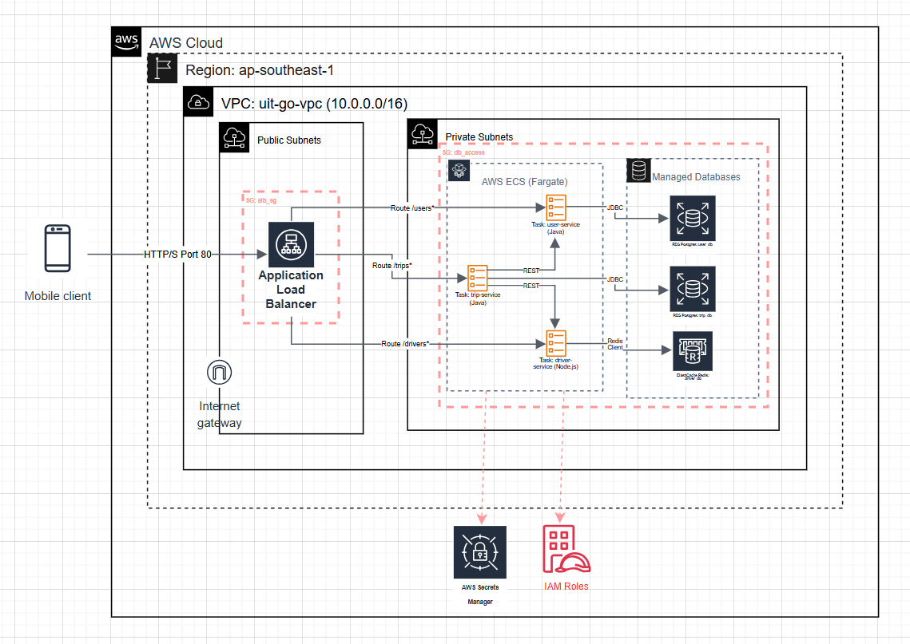
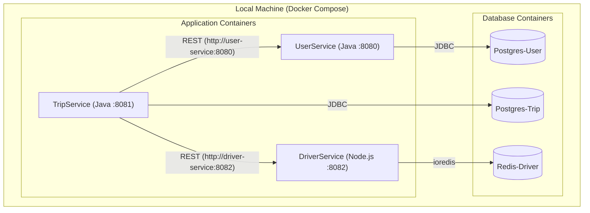
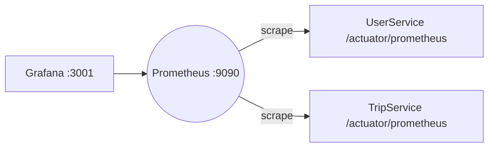

# Sơ đồ Kiến trúc Hệ thống - UIT-Go (Giai đoạn 1)

Tài liệu này mô tả kiến trúc hệ thống backend UIT-Go cho Giai đoạn 1, bao gồm cả kiến trúc ứng dụng microservices và kiến trúc hạ tầng triển khai chi tiết trên AWS.

## 1. Sơ đồ Kiến trúc Triển khai trên AWS (Chi tiết Giai đoạn 1)

Sơ đồ dưới đây (vẽ bằng Draw.io) minh họa cách 3 microservices được triển khai bằng **AWS ECS Fargate** trong các **private subnets**, truy cập dữ liệu từ **RDS PostgreSQL** và **ElastiCache Redis** (cũng đặt trong private subnets), và nhận traffic từ Internet thông qua **Application Load Balancer (ALB)** đặt trong **public subnets**. Toàn bộ hạ tầng được quản lý bằng **Terraform (IaC)**.

*(File nguồn Draw.io: `docs/diagrams/aws_architecture_g1.drawio`)*

## 2. Mô tả Luồng Chi tiết (Ví dụ: Tạo chuyến đi)

1.  **Client** gửi yêu cầu `POST /trips` đến **DNS Name** của **ALB**.
2.  **ALB Security Group (`alb_sg`)** cho phép traffic vào port 80.
3.  **ALB Listener** nhận request và dựa trên **Listener Rule** (điều kiện `path_pattern = "/trips*"`), chuyển tiếp request đến **Target Group `trip_tg`**.
4.  **Target Group `trip_tg`** chọn một **IP** của Task **TripService** đang chạy khỏe mạnh (health check OK) trong **private subnets**.
5.  **TripService Container** (Java/Fargate) nhận request:
    * **Gọi UserService:** Gửi request nội bộ (qua mạng VPC) đến **UserService Container** (`GET /users/me`).
    * **Gọi DriverService:** Gửi request nội bộ đến **DriverService Container** (`GET /drivers/search`).
6.  **DriverService Container** (Node.js/Fargate) nhận request:
    * Truy vấn **ElastiCache Redis** (`uit-go-redis-cluster`) qua endpoint nội bộ (trong VPC, được phép bởi **Security Group `db_access`**).
    * Trả kết quả (danh sách tài xế ONLINE) về cho TripService.
7.  **TripService Container:**
    * Ghi dữ liệu chuyến đi vào **RDS PostgreSQL** (`uit-go-trip-db`) qua endpoint nội bộ (trong VPC, được phép bởi **Security Group `db_access`**). Mật khẩu được lấy từ **AWS Secrets Manager** thông qua **IAM Task Role**.
    * Trả response về cho ALB -> Client.

## 3. Quản lý Hạ tầng

Toàn bộ hạ tầng AWS (VPC, Subnets, ALB, RDS, ElastiCache, ECS Cluster, IAM Roles, Secrets Manager...) được định nghĩa và quản lý bằng **Terraform**, đảm bảo tính nhất quán và khả năng tái lập (IaC). Mã nguồn Terraform nằm trong thư mục `/terraform`.

## 4. Môi trường Phát triển Local (Demo Cột mốc 1)

Để phát triển và demo tại Cột mốc 1, hệ thống chạy trên Docker Compose với kiến trúc tương tự về mặt logic ứng dụng, nhưng CSDL là các container Docker thay vì dịch vụ AWS.

### 4.1. API Gateway (Local)

Để hợp nhất các endpoint và áp dụng xác thực tập trung khi phát triển local, kiến trúc bổ sung một lớp Gateway dùng NGINX:

- Container: `gateway/nginx` (port host: `8088`)
- Public routes (không yêu cầu JWT):
    - `POST /api/users` (đăng ký)
    - `POST /api/sessions` (đăng nhập, trả về `access_token`)
    - `POST /api/trips/estimate` (ước tính chi phí quãng đường)
- Protected routes (yêu cầu JWT ở header `Authorization: Bearer ...`):
    - `GET|POST /api/trips/**`
    - `GET /api/users/me`
    - `GET /api/drivers/**`
- Cơ chế xác thực: NGINX dùng `auth_request` gọi nội bộ đến `auth-service` (`GET /validate`) để xác minh JWT; nếu hợp lệ thì mới forward request đến service đích.

Lưu ý: `auth-service` chỉ phục vụ validate token (stateless) và dùng chung `JWT_SECRET` với các service tạo token.

### 4.2. Monitoring & Observability (Local)

Hệ thống local đã tích hợp sẵn quan trắc (observability) để theo dõi sức khỏe và hiệu năng:

- Prometheus (port `9090`): thu thập metrics từ Spring Boot qua endpoint `/actuator/prometheus` của `user-service` và `trip-service`.
- Grafana (port host `3001`): đã auto-provisioned sẵn datasource tới Prometheus và dashboard tổng quan "UIT-Go Services Overview" (HTTP traffic, p95 latency, JVM heap, error rate, DB pool, threads).
- Health endpoints: `/actuator/health` đã mở công khai để health-check; metrics endpoint `/actuator/prometheus` được whitelist để Prometheus có thể scrape.

Sơ đồ tối giản cho observability local (ý niệm):

### 4.3. Tổng hợp cổng dịch vụ (Local)

- Gateway (NGINX): http://localhost:8088
- Prometheus: http://localhost:9090
- Grafana: http://localhost:3001 (mặc định `admin`/`admin`)

---

## 5. Ánh xạ khi triển khai Cloud/Kubernetes (Định hướng)

Khi đưa lên môi trường cloud/production, các thành phần local được ánh xạ như sau:

- API Gateway:
    - AWS ECS/Fargate: sử dụng **Application Load Balancer (ALB)** thay thế nginx container (routing theo path, health check, SSL termination).
    - Kubernetes (EKS): sử dụng **Ingress Controller** (Nginx/ALB Ingress Controller) thay thế nginx container.
- Monitoring:
    - AWS Managed: **Amazon Managed Prometheus (AMP)** và **Amazon Managed Grafana (AMG)**, hoặc **CloudWatch** cho metrics/logs cơ bản.
    - Kubernetes (EKS): cài đặt qua Helm chart `kube-prometheus-stack` (Prometheus + Grafana + Alertmanager).
- Secrets:
    - Sử dụng **AWS Secrets Manager** (đã mô tả trong ADR-006) thay `.env` cục bộ.

Tài liệu tham khảo quyết định kiến trúc:

- ADR-005: Chọn Terraform để quản lý hạ tầng
- ADR-006: Sử dụng Secrets Manager cho mật khẩu RDS
- ADR-007: Đặt CSDL trong private subnets
- ADR-008: Chọn ECS để triển khai container
- ADR-009: Chọn Fargate launch type cho ECS