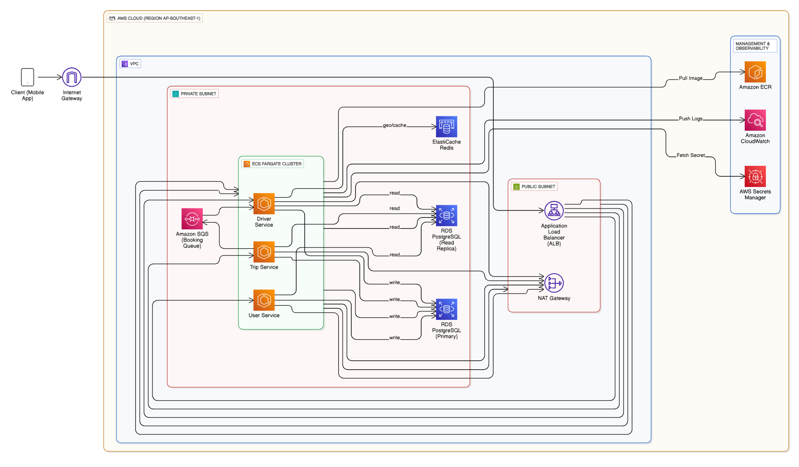
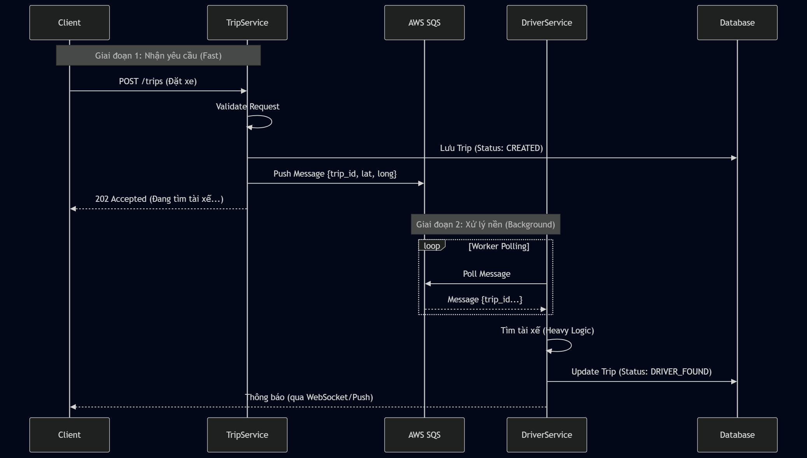
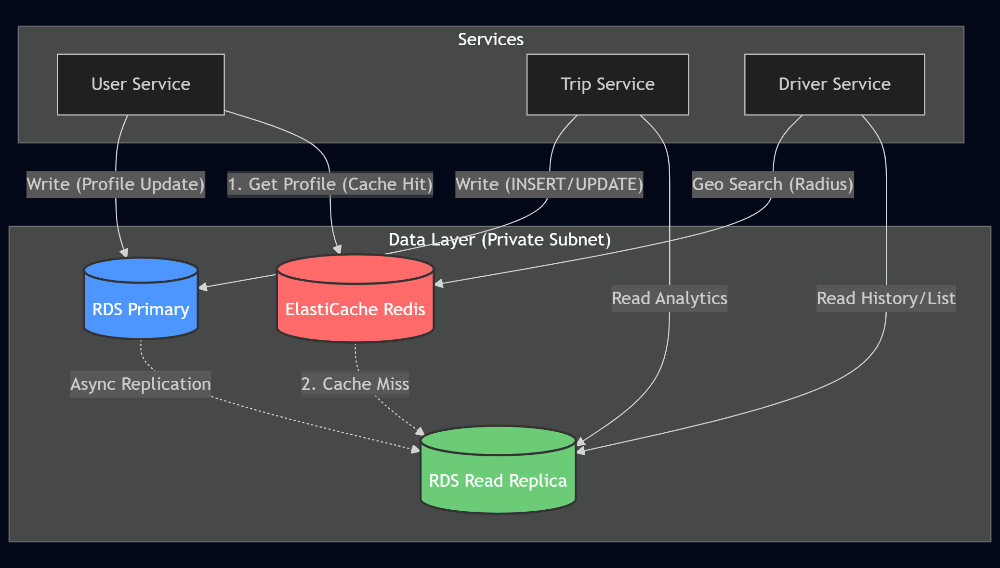
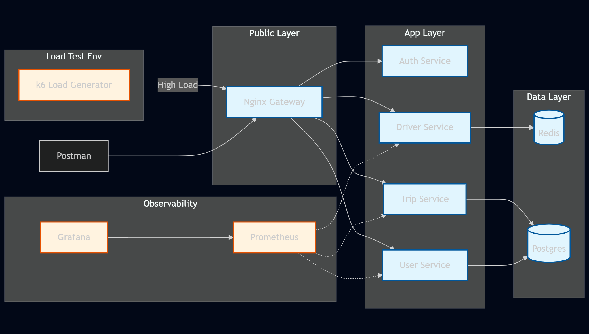

# Kiến trúc Hệ thống (System Architecture)

Tài liệu này mô tả chi tiết kiến trúc của hệ thống **UIT-Go Backend**, bao gồm kiến trúc triển khai thực tế trên Cloud (AWS) đáp ứng các yêu cầu phi chức năng (Module A) và kiến trúc môi trường phát triển cục bộ (Local Development).

## 1. Kiến trúc Cloud (AWS - Production)

Đây là kiến trúc tổng quan (High-Level Architecture) cho môi trường Production, được thiết kế theo các nguyên lý của **AWS Well-Architected Framework** để đảm bảo tính bảo mật, tin cậy và khả năng mở rộng.

### Sơ đồ Kiến trúc Tổng quan

**Mô tả các thành phần chính trong sơ đồ:**

- **VPC (Virtual Private Cloud)**: Môi trường mạng biệt lập chứa toàn bộ hệ thống.
- **Public Subnet**:
  - **Application Load Balancer (ALB)**: Cửa ngõ duy nhất nhận traffic từ Internet (Client App).
  - **NAT Gateway**: Cung cấp lối ra Internet an toàn cho các service bên trong Private Subnet (để pull image, đẩy log).
- **Private Subnet**:
  - **ECS Fargate Cluster**: Nơi chạy các container ứng dụng (User, Trip, Driver Service) mà không cần quản lý server.
  - **Data Layer**: Bao gồm RDS PostgreSQL (Primary & Read Replica) và ElastiCache Redis.
  - **Integration**: Amazon SQS đóng vai trò hàng đợi xử lý bất đồng bộ cho luồng đặt chuyến.
- **Management & Observability**: Các dịch vụ hỗ trợ vận hành như AWS Secrets Manager (quản lý mật khẩu), CloudWatch (logs), ECR (lưu trữ Docker images).

### Các thành phần chính

Hệ thống được xây dựng dựa trên các quyết định kiến trúc (ADR) quan trọng, đặc biệt là các ADR thuộc **Module A (Scalability)**:

1.  **Compute (Tính toán):**

    - Sử dụng **AWS ECS Fargate** (Serverless Container) giúp loại bỏ gánh nặng quản lý server vật lý.
    - **Auto Scaling (Module A - ADR-004):** Tự động tăng giảm số lượng task dựa trên CPU/Memory.

2.  **Database (Cơ sở dữ liệu):**

    - **RDS PostgreSQL:** Triển khai mô hình **Primary/Read Replica (Module A - ADR-002)**. Primary phục vụ ghi, Replica phục vụ đọc để phân tải.
    - **ElastiCache Redis:** Đóng vai trò bộ nhớ đệm trung tâm và xử lý dữ liệu địa lý.

3.  **Networking & Security:**
    - **VPC Segmentation (Basic - ADR-013):** Toàn bộ Database và Application Server nằm trong Private Subnet.
    - **NAT Gateway:** Đảm bảo kết nối Internet chiều đi (Outbound) an toàn cho các Private Resources.

---

## 2. Kiến trúc Chi tiết Module A (Scalability & Performance)

Phần này đi sâu vào các cơ chế xử lý bên trong giúp hệ thống chịu tải cao (High Load), minh họa cho các ADR của Module A.

### 2.1. Luồng Xử lý Đặt chuyến Bất đồng bộ (Async Booking Flow)

_Minh họa cho **Module A - ADR-001 (Async Processing)**._

Thay vì xử lý tuần tự (Synchronous) dễ gây nghẽn, hệ thống sử dụng SQS để tách rời việc nhận yêu cầu và xử lý nghiệp vụ tìm tài xế.

_(Source: [docs/diagrams/mermaid/booking_flow.mmd](diagrams/mermaid/booking_flow.mmd))_

### 2.2. Chiến lược Dữ liệu & Caching (Data Access Strategy)

_Minh họa cho **Module A - ADR-002 (Read Replicas)** và **Module A - ADR-003 (Caching Strategy)**._

Hệ thống tối ưu hóa hiệu năng bằng cách định tuyến các loại truy vấn đến đúng nơi lưu trữ phù hợp nhất.

_(Source: [docs/diagrams/mermaid/data_strategy.mmd](diagrams/mermaid/data_strategy.mmd))_

**Giải thích:**

1.  **Write Path:** Mọi thao tác thay đổi dữ liệu đều đi vào **RDS Primary**.
2.  **Read Path (User Profile):** Áp dụng **Cache-Aside**. User Service hỏi Redis trước, nếu không có mới hỏi DB (Replica).
3.  **Read Path (Geo-spatial):** Driver Service truy vấn vị trí tài xế trực tiếp từ **Redis** (tốc độ < 1ms) thay vì PostGIS.
4.  **Read Path (Heavy Query):** Các truy vấn danh sách/lịch sử được chuyển sang **RDS Replica** để giảm tải cho Primary.

---

## 3. Kiến trúc Local (Development)

Môi trường local được đơn giản hóa bằng **Docker Compose** để phục vụ phát triển và kiểm thử tính năng, mô phỏng logic của hệ thống Cloud.

_(Source: [docs/diagrams/mermaid/local_arch.mmd](diagrams/mermaid/local_arch.mmd))_

### Đặc điểm môi trường Local

- **Gateway:** Sử dụng Nginx làm Entrypoint thay cho AWS ALB.
- **Database:** Chạy 01 container Postgres (không chia Primary/Replica) và 01 container Redis.
- **Service Discovery:** Sử dụng tên service của Docker Network.
