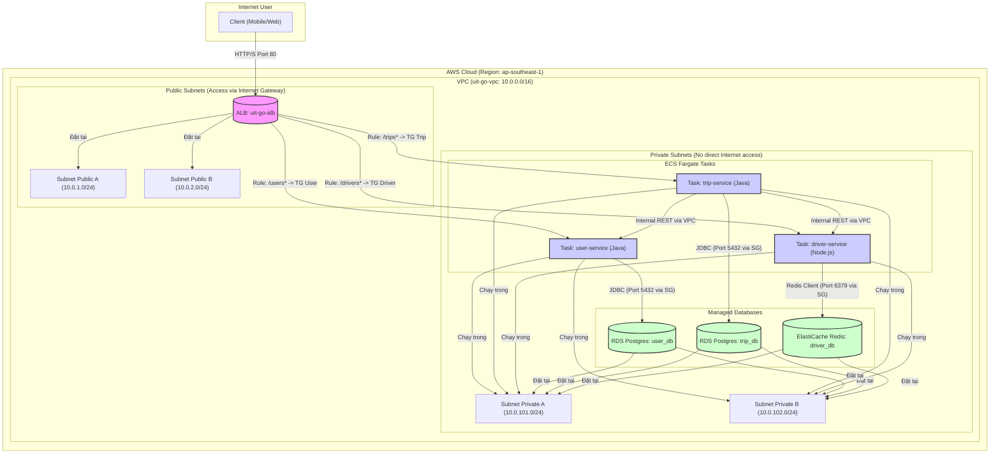

# Sơ đồ Kiến trúc Hệ thống - UIT-Go (Giai đoạn 1)

Tài liệu này mô tả kiến trúc hệ thống backend UIT-Go cho Giai đoạn 1, bao gồm cả kiến trúc ứng dụng microservices và kiến trúc hạ tầng triển khai chi tiết trên AWS, đáp ứng các yêu cầu kỹ thuật trong Mục 3.2 của đề bài.

## 1. Sơ đồ Kiến trúc Triển khai trên AWS (Chi tiết Giai đoạn 1)

Sơ đồ dưới đây (vẽ bằng Mermaid) minh họa cách 3 microservices được triển khai bằng **AWS ECS Fargate** trong các **private subnets**, truy cập dữ liệu từ **RDS PostgreSQL** và **ElastiCache Redis** (cũng đặt trong private subnets), và nhận traffic từ Internet thông qua **Application Load Balancer (ALB)** đặt trong **public subnets**. Toàn bộ hạ tầng được quản lý bằng **Terraform (IaC)**.

