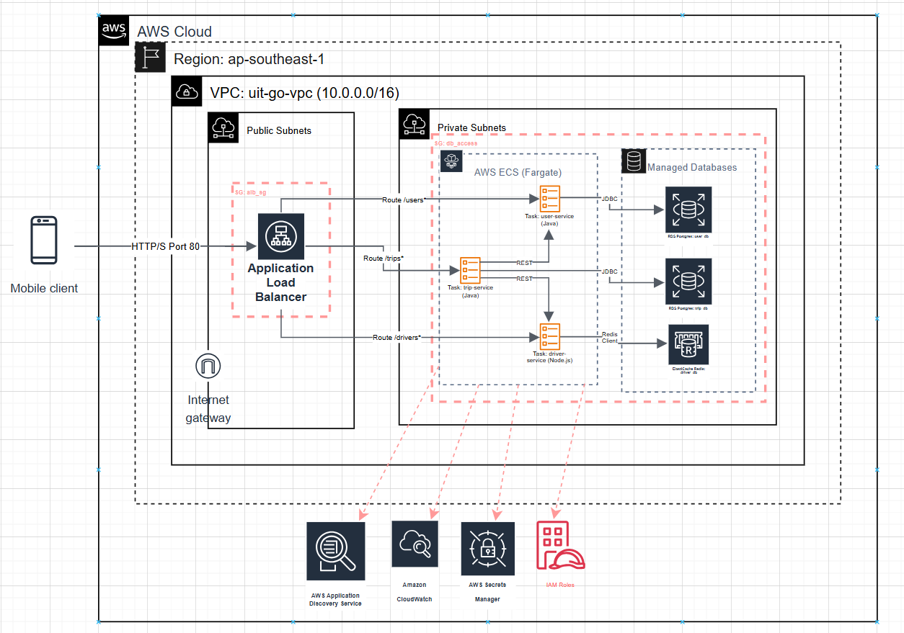

# Báo cáo Cột mốc 1: Đồ án SE360 - UIT-Go
## (Hệ thống Backend Microservices Cloud-Native)

### Thông tin chung
- **Thành viên A (Backend Logic)**: Nguyễn Việt Khoa - 22520682
- **Thành viên B (Backend Platform)**: Nguyễn Quốc Bảo - 23520126 
- **Giảng viên hướng dẫn**: Lê Văn Tuấn 

**Module Chuyên sâu (Giai đoạn 2)**: Module A - Thiết kế Kiến trúc cho Scalability & Performance

## 1. Tổng quan kiến trúc hệ thống

Kiến trúc Giai đoạn 1 được thiết kế để đáp ứng toàn bộ 10 User Stories cơ bản. Hệ thống bao gồm 3 microservices chính, áp dụng kiến trúc đa ngôn ngữ (polyglot) và tuân thủ nguyên tắc "Database per Service".

Toàn bộ hạ tầng được định nghĩa bằng Terraform (Infrastructure as Code - IaC) và triển khai trên AWS ECS Fargate, với CSDL (RDS, ElastiCache) nằm trong private subnets để đảm bảo bảo mật.

### Sơ đồ Kiến trúc Triển khai (Giai đoạn 1)
Sơ đồ dưới đây (vẽ bằng Draw.io) minh họa kiến trúc tổng quan của hệ thống trên AWS, bao gồm luồng traffic từ Internet qua ALB, vào ECS Fargate Tasks (nằm trong private subnets), và cách các service giao tiếp nội bộ (qua AWS Cloud Map) và kết nối đến các CSDL (RDS, ElastiCache).

(Xem chi tiết tại: [ARCHITECTURE.md](ARCHITECTURE.md))

## 2. Phân tích Module chuyên sâu (Module A)
Nhóm đã lựa chọn Module A: Thiết kế Kiến trúc cho Scalability & Performance cho Giai đoạn 2.

### Mục tiêu của Module A
Tập trung vào việc thiết kế và kiểm chứng một kiến trúc có khả năng đạt tới "hyper-scale" (khả năng mở rộng quy mô cực lớn), phù hợp với bản chất của ứng dụng gọi xe, nơi luồng nghiệp vụ tìm kiếm tài xế và cập nhật vị trí đòi hỏi hiệu năng cao và khả năng chịu tải đột biến.

*Kế hoạch thực hiện Giai đoạn 2: (Kế hoạch chi tiết cho Module A được trình bày trong một tài liệu riêng được gửi kèm trong folder nộp báo cáo giai đoạn 1)*

## 3. Tổng hợp Các quyết định thiết kế và Trade-off (ADRs)

### 3.1. ADR 001: Lựa chọn RESTful API 
- **Quyết định**: Sử dụng RESTful API cho giao tiếp service-to-service.
- **Lý do (Ưu tiên)**: Tốc độ phát triển và tính tương thích đa ngôn ngữ (Polyglot)
- **Đánh đổi (Chấp nhận)**: Chấp nhận hiệu năng (overhead/độ trễ) của HTTP/JSON sẽ cao hơn so với gRPC.

### 3.2. ADR 002: Lựa chọn Redis Geospatial
- **Quyết định**: Sử dụng Redis (ElastiCache) với tính năng Geospatial để lưu trữ vị trí tài xế.
- **Lý do (Ưu tiên)**: Tốc độ truy vấn (Speed-first)
- **Đánh đổi (Chấp nhận)**: Chi phí vận hành (RAM) cao hơn

### 3.3. ADR 003: Lựa chọn Kiến trúc Đa ngôn ngữ (Polyglot)
- **Quyết định**: Sử dụng Java (Spring Boot) và Node.js (Express)
- **Lý do (Ưu tiên)**: Đúng công cụ cho đúng việc
- **Đánh đổi (Chấp nhận)**: Phức tạp vận hành

### 3.4. ADR 004: Lựa chọn Polling cho Theo dõi Vị trí
- **Quyết định**: Sử dụng HTTP Polling
- **Lý do (Ưu tiên)**: Tốc độ hoàn thành (Velocity)
- **Đánh đổi (Chấp nhận)**: Trải nghiệm người dùng có độ trễ

### 3.5. ADR 005: Lựa chọn Terraform (IaC)
- **Quyết định**: Sử dụng Terraform cho quản lý hạ tầng
- **Lý do (Ưu tiên)**: Tính nhất quán và tránh Vendor Lock-in
- **Đánh đổi (Chấp nhận)**: Tốn thời gian học cú pháp

### 3.6. ADR 006 & 007: Bảo mật CSDL
- **Quyết định**: CSDL trong Private Subnets & Secrets Manager
- **Lý do (Ưu tiên)**: Bảo mật Tối đa
- **Đánh đổi (Chấp nhận)**: Phức tạp hơn khi debug

### 3.7. ADR 008 & 009: Lựa chọn Triển khai ECS Fargate
- **Quyết định**: Sử dụng AWS ECS với Fargate
- **Lý do (Ưu tiên)**: Đơn giản Vận hành Tối đa
- **Đánh đổi (Chấp nhận)**: Chi phí có thể cao hơn

### 3.8. ADR 011: Lựa chọn AWS Cloud Map
- **Quyết định**: Sử dụng AWS Cloud Map cho Service Discovery
- **Lý do (Ưu tiên)**: Hiệu năng & Kiến trúc Chuẩn
- **Đánh đổi (Chấp nhận)**: Tăng độ phức tạp cấu hình

### 3.9. ADR 012: Lựa chọn AWS ECR
- **Quyết định**: Sử dụng AWS ECR cho Container Registry
- **Lý do (Ưu tiên)**: Bảo mật Tích hợp và Tốc độ
- **Đánh đổi (Chấp nhận)**: "Vendor lock-in" mức registry

### 3.10. ADR 010: Tái cấu trúc Code IaC
- **Quyết định**: Tái cấu trúc thành 3 Terraform Modules
- **Lý do (Ưu tiên)**: Tính bảo trì và rõ ràng
- **Đánh đổi (Chấp nhận)**: Tốn công sức refactor

## 4. Thách thức & Bài học kinh nghiệm (Giai đoạn 1)

### Thách thức Gặp phải
1. **Thách thức về Giới hạn Tài khoản AWS**
    - Giới hạn dịch vụ cho tài khoản mới
    - Vấn đề với ALB và quyền hạn
    - Gián đoạn tiến độ triển khai

2. **Thách thức Kỹ thuật (IaC & Refactor)**
    - Quản lý 40+ tài nguyên AWS
    - Phức tạp trong refactor Terraform

3. **Thách thức Thiết kế**
    - Vấn đề giao tiếp nội bộ
    - Implement Service Discovery

4. **Thách thức Tích hợp Đa ngôn ngữ**
    - Đồng bộ DTOs giữa Java và Node.js

### Bài học kinh nghiệm
- Sức mạnh của IaC
- Tầm quan trọng của ADRs
- Giá trị của việc Refactor

## 5. Kết quả & Hướng phát triển

### Kết quả Giai đoạn 1
1. **Hạ tầng (IaC)**
    - 100% mã nguồn Terraform
    - Refactor hoàn chỉnh

2. **Thiết kế**
    - ARCHITECTURE.md
    - 12 ADRs

3. **Ứng dụng**
    - Logic cho 10 User Stories
    - Clean Code và Unit Tests

4. **Tích hợp**
    - Kiểm thử thành công local

### Hướng phát triển
1. **Hoàn thiện Triển khai**
    - Build và push Docker images
    - Cập nhật task definitions
    - Triển khai final

2. **Thiết lập CI/CD**
    - GitHub Actions pipeline

3. **Hiện thực Module A**
    - Load Testing
    - Tối ưu hóa hệ thống
    - Phân tích và cải tiến

